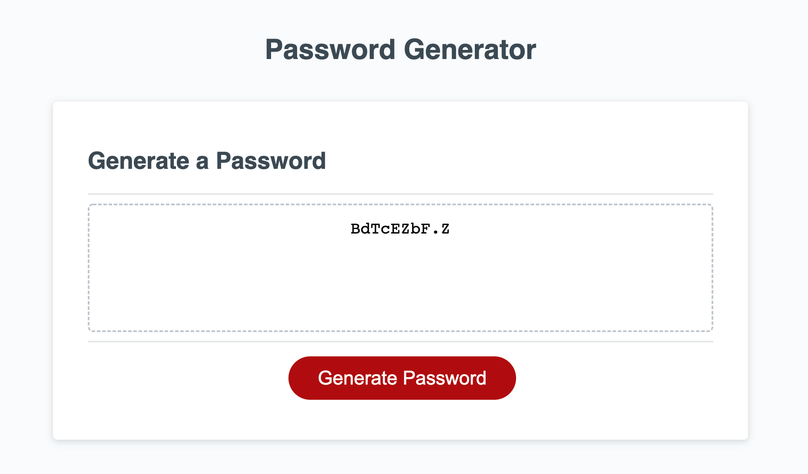

# Password-generator

## Description 

This week's challenge was to create an application that an employee can use to generate a random password based on criteria they've selected.

The main acceptance criteria were as follow:
- be presented with a series of prompts for password criteria
- length of password at least 8 characters and no more than 128 characters
- at least one character type should be selected
- the generated password is must match the selected criteria

## What I learned
I learned many important fundamentals of javascript creating this project. I used a combination of arrays, function calls and how to return values, for statements as well as Math.Floor and Math.random.

## Challenges
This was the first javascript project I worked on so there were a few challenges in completing this project. I struggled to figure out how to best organise my code. I was able to push through by searching documentation and trying a few different ways of getting the expected result. 

### Link to deployed page

https://appolinefr.github.io/Password-generator/

#### Screenshot of deployed page

